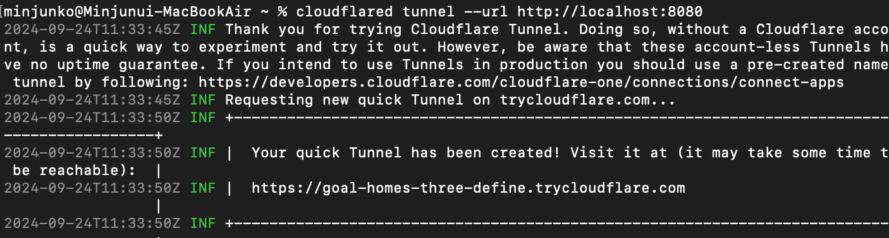
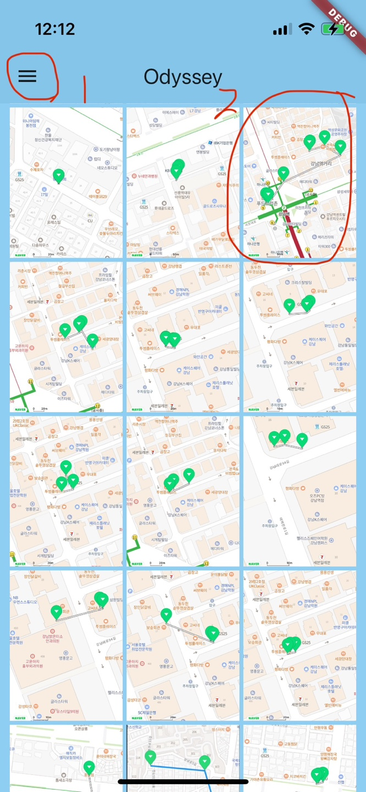
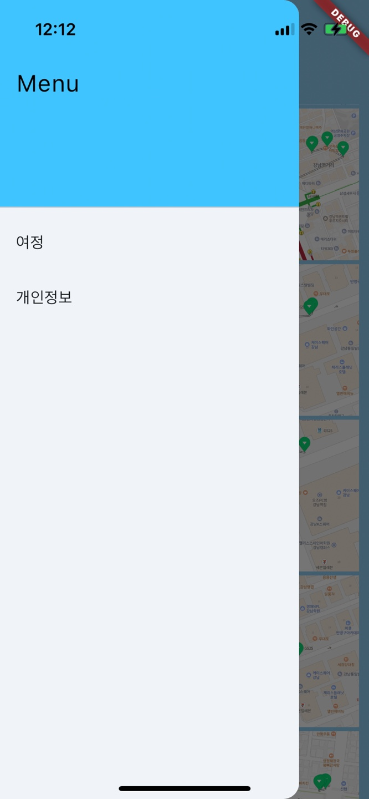
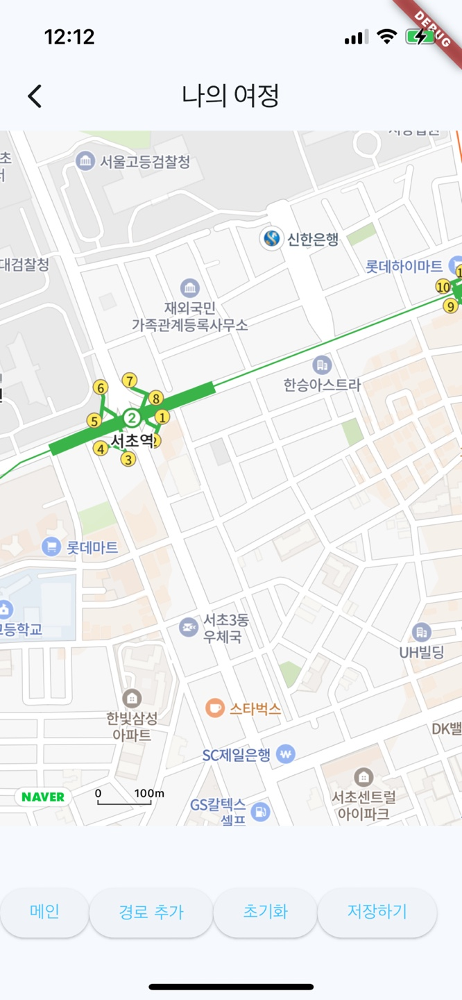
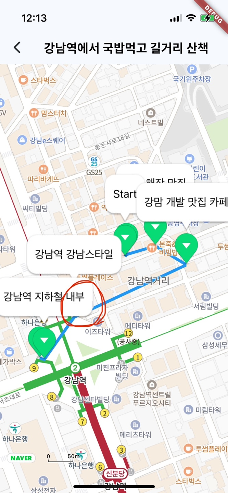
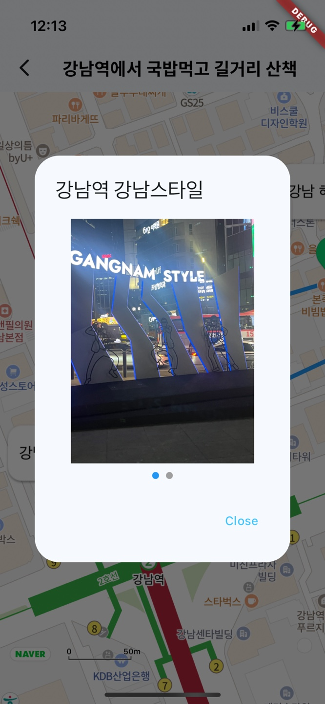

# OdysseyApp

# 1. 프로젝트 목적
이 프로젝트는 여행 일지를 기록하고 공유하는 App(Flutter)과 App Server를 구현한 프로젝트입니다.</br>
**[App Server 레포지토리 GitHub Link](https://github.com/gominnam/OdysseyLog)**</br>
App의 주요 기능은 다음과 같습니다:

- **위치기반 서비스**: `NaverMap`을 이용하여 위치기반 서비스 제공합니다.
- **무한 스크롤 API 호출**: 메인 화면에서 무한 스크롤을 이용하여 API를 호출합니다.
- **이미지 로딩 최적화**: 이미지 파일을 원본과 압축된 두 가지 형태로 저장하여 로딩을 최적화합니다.
- **상태 관리**: Provider를 통해 모델 상태를 관리합니다.
</br></br>

# 2. 개발 환경

- Language: Kotlin, Dart
- Framework: Flutter
- AWS S3 Storage, AWS Lambda
</br></br>


# 3. Trouble Shooting

## 1) Localhost에서 서버와 App 연동 테스트 문제

### 문제점
- 핸드폰과 컴퓨터끼리 직접 API 테스트를 할 수 없는 문제 발생

### 해결 방법
- CloudFlare에서 제공하는 Tunnel을 통해 문제를 해결
  - CloudFlare Tunnel을 사용하여 로컬 서버를 외부에서 접근 가능하도록 설정
  - 이를 통해 핸드폰에서 로컬 서버에 접근하여 API 테스트 가능


1. **Cloudflare Tunnel 설치**
```shell
brew install cloudflared
```

2. **설치 확인**
```shell
cloudflared --version
```

3. **Cloudflare Tunnel 실행**
```shell
//port 번호는 server를 실행하는 포트 번호로 설정
cloudflared tunnel --url http://localhost:8080
```

- 명령어 실행 후 terminal에 나오는 URL을 핸드폰에서 api 호출시 사용

</br>

</br></br>


# 4. 화면 구성

### 1. 메인페이지

 </br>

- 앱 실행 시 사용자들이 작성한 경로들을 GET 요청으로 가져옵니다. (15개씩 스크롤 API 요청)

### 2. 메뉴 탭(메인페이지에서 1번)

</br>

- 여정버튼 클릭 시 3번 여정 페이지로 이동합니다.

### 3. 여정 페이지

 </br>

 - **메인**: 메인화면으로 이동합니다.
 - **경로 추가**: 현재 위치 기반으로 마커 생성
 - **초기화**: 모든 마커 초기화
 - **저장하기**: 현재 기록한 이미지, 텍스트들을 서버로 POST API를 호출하여 저장합니다.

### 4. 여정 상세화면(메인페이지에서 2번 클릭 시)

 </br>

- 사용자가 저장한 데이터를 기반으로 마크다운 시각화
- 마크다운마다 작성한 메모들을 표시합니다.


### 5. 마크다운 상세(여정 상세화면에서 마크다운 터치)

  </br>

  - 작성한 메모와 업로드한 이미지를 볼 수 있는 팝업창 호출합니다.

 
 ## 4. Reference


- [Flutter Naver Map](https://note11.dev/flutter_naver_map/)
- [AWS S3 Presigned URL](https://docs.aws.amazon.com/AmazonS3/latest/userguide/PresignedUrlUploadObject.html)
- [AWS LABMDA](https://docs.aws.amazon.com/lambda/latest/dg/welcome.html)
- [Cloudflare Tunnel](https://developers.cloudflare.com/pages/how-to/preview-with-cloudflare-tunnel/)